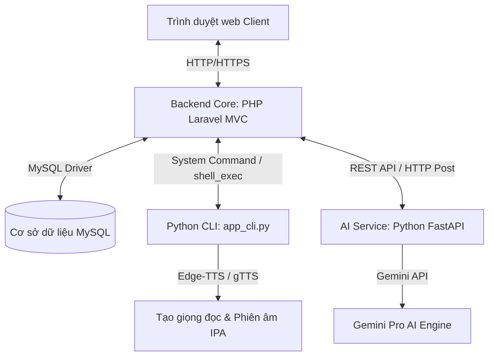

# ListenUp - Hệ Thống Luyện Nghe Tiếng Anh Tương Tác (Gamification & AI)

ListenUp là nền tảng trực tuyến hỗ trợ luyện nghe tiếng Anh toàn diện từ cơ bản đến nâng cao. Ứng dụng tích hợp phương pháp **Trò chơi hóa (Gamification)** thông qua 10 bản đồ trò chơi tương tác độc đáo và **Trí tuệ nhân tạo (AI)** giúp cá nhân hóa lộ trình học, tóm tắt bài nghe và hỗ trợ chuyển đổi ngữ âm tự động.

---

## 🚀 1. Mục Tiêu Đồ Án (Project Objectives)

* **Nâng cao kỹ năng nghe tiếng Anh**: Xây dựng lộ trình học qua 10 cấp độ kỹ năng nghe khác nhau (nghe từ khóa, nghe chính tả, phân biệt âm tiết gần giống, nghe điền từ...).
* **Trải nghiệm học tập lôi cuốn**: Áp dụng cơ chế Gamification với hệ thống tích lũy điểm (`DiemMan`), mở khóa bản đồ (`TienTrinh`), khung viền avatar phần thưởng và bảng xếp hạng (`Leaderboard`) thời gian thực.
* **Tích hợp Trí tuệ Nhân tạo (AI)**:
  * Chuyển đổi văn bản thành giọng đọc nói chuẩn (Text-to-Speech) đa dạng accent (Mỹ, Anh, Úc), tốc độ tùy chỉnh.
  * Tự động phiên âm ký tự ngữ âm quốc tế **IPA** để học viên đối chiếu phát âm.
  * Chatbot hỗ trợ giải đáp học tập, tóm tắt transcript và đề xuất lộ trình học dựa trên hiệu suất thực tế.

---

## 🏗️ 2. Kiến Trúc Hệ Thống (System Architecture)

ListenUp được thiết kế theo kiến trúc hỗn hợp **Hybrid MVC + Microservice**, kết hợp độ tin cậy của PHP Laravel và sự linh hoạt xử lý ngôn ngữ tự nhiên của Python:



### Chi tiết các tầng công nghệ:
* **Core Backend**: PHP 8.1+ / Laravel 10.x quản lý cơ sở dữ liệu (Eloquent ORM), xác thực đăng nhập Google (Socialite), kiểm soát định tuyến và phân quyền Middleware (`admin`, `user`).
* **Database**: MySQL lưu trữ dữ liệu tài khoản, đề thi, câu hỏi, phương án trả lời, tiến trình học và bảng xếp hạng.
* **AI Subsystem (Python)**:
  * **FastAPI Server (port 8001)**: Giao tiếp với API Gemini của Google để cung cấp chatbot học tập, tóm tắt bài nghe và cá nhân hóa lộ trình.
  * **CLI Tool (`app_cli.py`)**: Tương tác trực tiếp với thư viện `edge-tts` và `eng_to_ipa` để sinh file âm thanh giọng đọc và phiên âm IPA thời gian thực.
* **Frontend**: Blade Templates, TailwindCSS (phong cách Glassmorphic hiện đại), JavaScript xử lý logic game tương tác và điều khiển audio visualizer.

---

## 💻 3. Các Phần Mềm Cần Thiết Để Triển Khai (Prerequisites)

Để hệ thống hoạt động ổn định, máy chủ triển khai cần cài đặt trước các phần mềm sau:
1. **PHP >= 8.1** (đã kích hoạt các extension cần thiết như `openssl`, `pdo_mysql`, `mbstring`, `curl`).
2. **Composer** (quản lý thư viện PHP).
3. **MySQL >= 5.7** hoặc **MariaDB**.
4. **Python >= 3.8** (cần thiết cho module xử lý AI và sinh giọng đọc).
5. **Thư viện ffmpeg** (khuyến nghị có sẵn trong PATH để xử lý file âm thanh tốt nhất).
6. **Laragon** hoặc **XAMPP** (nếu triển khai trên môi trường Windows local).

---

## 🛠️ 4. Hướng Dẫn Cách Thức Chạy Chương Trình (Deployment Guide)

### Bước 1: Chuẩn bị mã nguồn và thư mục
1. Tải toàn bộ mã nguồn của dự án về máy.
2. Mở cửa sổ terminal (PowerShell hoặc CMD) tại thư mục gốc của dự án.

### Bước 2: Cấu hình môi trường Laravel
1. Tạo file cấu hình môi trường `.env` từ file mẫu:
   ```bash
   copy .env.example .env
   ```
2. Mở file `.env` vừa tạo và cấu hình các thông số kết nối Database:
   ```env
   DB_CONNECTION=mysql
   DB_HOST=127.0.0.1
   DB_PORT=3306
   DB_DATABASE=english_listening_db
   DB_USERNAME=root
   DB_PASSWORD=your_mysql_password
   ```
3. Cập nhật khóa API Gemini để kích hoạt Trợ lý AI:
   ```env
   GEMINI_API_KEY=your_gemini_api_key_here
   ```

### Bước 3: Cài đặt PHP dependencies & Tạo Key
```bash
composer install
php artisan key:generate
```

### Bước 4: Thiết lập cơ sở dữ liệu
1. Tạo một cơ sở dữ liệu trống có tên `english_listening_db` trong MySQL với mã hóa `utf8mb4_unicode_ci`.
2. Chạy migration và seed dữ liệu mẫu (bao gồm tài khoản Admin, Học viên mặc định và cấu trúc bản đồ):
   ```bash
   php artisan migrate --seed
   ```
3. Tạo liên kết thư mục lưu trữ file media công khai:
   ```bash
   php artisan storage:link
   ```

### Bước 5: Cài đặt và cấu hình AI Subsystem (Python)
1. Di chuyển vào thư mục `/CA`:
   ```bash
   cd CA
   ```
2. Tạo môi trường ảo Python (Virtual Environment) và kích hoạt:
   ```bash
   python -m venv venv
   # Kích hoạt trên Windows:
   .\venv\Scripts\activate
   # Kích hoạt trên macOS/Linux:
   source venv/bin/activate
   ```
3. Cài đặt các gói thư viện cần thiết:
   ```bash
   pip install -r requirements.txt
   ```
4. Khởi chạy máy chủ FastAPI (chạy trên cổng 8001):
   ```bash
   uvicorn app:app --host 127.0.0.1 --port 8001 --reload
   ```

### Bước 6: Khởi chạy Laravel Server
Mở thêm một terminal mới tại thư mục gốc dự án và chạy:
```bash
php artisan serve
```
Hệ thống sẽ chạy tại địa chỉ mặc định: [http://127.0.0.1:8000](http://127.0.0.1:8000).

---

## 🔑 5. Tài Khoản Mặc Định
* **Quản trị viên (Admin)**:
  * **Email**: `admin@englishlistening.com`
  * **Mật khẩu**: `admin123`
* **Học viên (User)**:
  * **Email**: `user@englishlistening.com`
  * **Mật khẩu**: `user123`